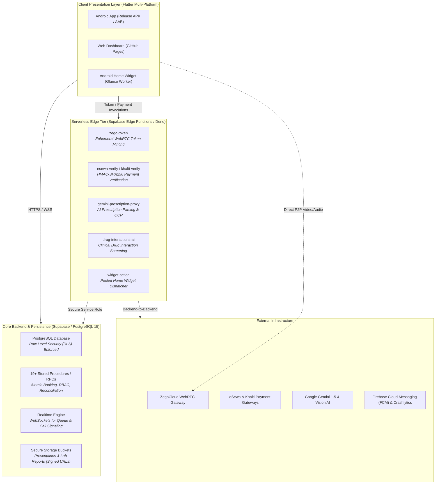

# SwasthAll

> **A Family-Centric Digital Healthcare Super-App & Telemedicine Platform**  
> Built with Flutter,  Supabase (PostgreSQL + Deno Edge Functions) , WebRTC,  and Localized Payment Gateways.

[](https://github.com/IshaShah04/Swasthall/actions/workflows/flutter-release.yml)
[](https://flutter.dev)
[](https://supabase.com)
[](https://www.zegocloud.com/)
[](#security--data-governance)

---

## Overview

Healthcare in emerging markets often forces patients and families to juggle disjointed systems: physical appointment lines, paper prescriptions, fragmented diagnostic reports, and manual payment workflows.

**SwasthAll** is an enterprise-grade digital health super-app designed for Nepal's healthcare ecosystem. It unifies the entire care continuum—connecting **Patients**, **Families**, **Doctors**, **Hospitals**, **Diagnostic Labs**, **Pharmacies**, and **Blood Banks** into a unified, secure platform with real-time video consultations, localized payments, client-encrypted records, and AI-assisted medical document intelligence.

---

## System Architecture

SwasthAll is architected as a distributed, privacy-first system separating public client applications from sensitive execution environments:



---

## Key Modules

### 1. Multi-Hospital & Doctor Consultation Scheduling
* **Atomic Double-Booking Prevention**: Database-level reservation RPC (`payment_booking_rpcs.sql`) enforces transactional row-locking to eliminate race conditions during concurrent appointment bookings.
* **Dynamic Fee & Availability Resolution**: Granular availability slot management supporting multi-facility doctors, department scheduling, and dynamic first-time vs. follow-up consultation fees.
* **Offline-Resilient Booking**: Client-side offline request queueing (`offline_booking_queue.dart`) synchronizes bookings when network connectivity drops.

### 2. Real-Time Telemedicine & Call Signaling
* **WebRTC Video Consultations**: Integrated with ZegoCloud WebRTC SDK for high-definition, low-latency audio/video consultations across mobile and web.
* **Zero-Secret Token Minting**: Client binaries never package `appSign` or static credentials. Ephemeral access tokens are securely minted on-demand via the `zego-token` Supabase Edge Function based on verified session JWTs.
* **Full In-App Signaling**: WebSocket channels track provider call readiness, active call state transitions, and automatic timeout handling.

### 3. Client-Side Encrypted Health Vault (Zero-Knowledge Privacy)
* **AES-256-GCM Encryption**: Sensitive patient health records and notes are encrypted on-device before transmission using `encryption_utils.dart`.
* **Cryptographic Key Derivation**: Uses PBKDF2 with unique salts retrieved via `get-encryption-salt` to prevent database administrators or third-party storage providers from reading private medical data in plaintext.
* **Signed Storage Access**: Diagnostic reports and scanned records utilize time-limited signed URLs generated strictly for authenticated family members or authorized physicians.

### 4. AI-Powered Clinical Intelligence
* **Prescription Digitization**: The `gemini-prescription-proxy` edge function leverages Google Gemini multimodal vision to extract medications, dosages, frequency, and instructions from handwritten prescriptions into structured JSON.
* **Drug-Drug Interaction Analysis**: Edge service (`drug-interactions-ai`) cross-references active medications against clinical drug databases to alert patients and providers of dangerous contraindications.

### 5. Localized Nepal Payment Integration
* **Dual Gateway Support**: Native integration with **eSewa** (SDK + WebView fallback) and **Khalti** payment gateways.
* **Server-Side HMAC-SHA256 Verification**: Payment signatures are never verified client-side. The `esewa-verify` and `khalti-verify` Edge Functions validate signatures against backend merchant secrets.
* **Idempotent Reconciliation**: Background payment reconciliation worker (`payment_reconciliation_service.dart`) handles network interruptions, drops, and pending callback verification.

### 6. Emergency Blood Bank & Community Care
* **Real-Time Blood Bank Registry**: Inventory tracking across blood groups, localized hospital blood banks, and nearby donation camps.
* **Donor Coordination**: Patient donation history cards, donation camp dispatch alerts, and emergency blood request broadcasts.

### 7. Android Glance Home Screen Widget
* **Connection-Pooled Dispatcher**: Rather than direct client database connections that cause connection exhaustion at scale, home screen queue widgets invoke a pooled serverless dispatcher (`widget-action`).

---

## 🛡️ Security & Data Governance

| Security Layer | Implementation Details |
|---|---|
| **Data in Transit** | Enforced TLS 1.3 for all REST and WebSocket connections. |
| **Data at Rest** | PostgreSQL disk encryption + Application-layer AES-256-GCM for medical records. |
| **Access Control (RBAC)** | Strict PostgreSQL **Row Level Security (RLS)** across all tables; every RPC validates `auth.uid()`. |
| **Secrets Management** | Compile-time injection via `--dart-define-from-file=env.json`. No secrets packaged in `flutter_assets`. |
| **API Gateways** | Zero client exposure for private keys; merchant secrets and AI keys reside strictly in Deno Edge runtimes. |
| **Binary Protection** | Production Android builds compiled with `--obfuscate` and `--split-debug-info` to prevent reverse engineering. |
| **Repository Hygiene** | Hardened `.gitignore`, zero committed keystores, and GitHub Push Protection enabled. |

---

##Supported Roles & Access Matrix

The system implements a granular Role-Based Access Control (RBAC) model:

```
┌─────────────────┬─────────────────────────────────────────────────────────────────┐
│ Role            │ Capabilities & Boundaries                                       │
├─────────────────┼─────────────────────────────────────────────────────────────────┤
│ Patient         │ Book appointments, manage health vault, family profiles, orders │
│ Doctor          │ View assigned queues, manage slots, conduct WebRTC video calls  │
│ Hospital Admin  │ Department management, staff linkage, facility analytics        │
│ Laboratory      │ Manage test catalogs, upload digital diagnostic reports         │
│ Pharmacy        │ Prescription fulfillment, medication inventory, order dispatch  │
│ Blood Bank      │ Inventory levels, donation camps, donor logs                    │
└─────────────────┴─────────────────────────────────────────────────────────────────┘
```

---

##Repository Structure

```text
Swasthall/
├── .github/workflows/          # CI/CD pipelines (Automated Android build & Pages deploy)
├── android/                    # Android host project & Gradle configuration
├── assets/                     # Application icons, medical illustrations, theme assets
├── ios/                        # iOS host project
├── web/                        # Web host project & GitHub Pages entrypoint
├── supabase/
│   ├── functions/              # 12+ Deno Edge Functions (Payments, AI, Zego, Widgets)
│   └── migrations/             # 19+ Audited PostgreSQL migrations, RLS policies & RPCs
└── lib/
    ├── config/                 # Compile-time environment configuration (EnvConfig)
    ├── features/
    │   ├── blood_bank/         # Blood bank registry, donation drives & donor logs
    │   ├── booking/            # Doctor appointment scheduling & slot reservation
    │   ├── hospital/           # Hospital profiles, facilities & doctor catalogs
    │   ├── labs/               # Diagnostic laboratory test booking & report views
    │   ├── pharmacies/         # Medicine search, essentials catalog & order cart
    │   ├── records/            # Health Vault, encrypted records & active care tracking
    │   └── study_hub/          # Patient medical education & quick reference library
    ├── models/                 # Strongly-typed immutable data entities
    ├── providers/              # Riverpod / state management providers
    ├── services/               # Edge proxies, payment coordinators, WebRTC & cache
    ├── utils/                  # AES-256 encryption utilities & key derivation helpers
    └── widgets/                # Reusable UI design system components
```

--

### Prerequisites
* **Flutter SDK**: `>= 3.22.0`
* **Dart SDK**: `>= 3.4.0`
* **Java**: OpenJDK 17
* **Supabase CLI** (for local migrations and edge function development)

### 1. Clone the Repository
```bash
git clone https://github.com/IshaShah04/Swasthall.git
cd Swasthall
```

### 2. Environment Configuration
Copy the example environment template:
```bash
cp env.example.json env.json
```
Populate `env.json` with your client public constants:
```json
{
  "SUPABASE_URL": "https://your-project.supabase.co",
  "SUPABASE_ANON_KEY": "your-anon-key",
  "ZEGO_APP_ID": "123456789",
  "ESEWA_SDK_CLIENT_ID": "your-esewa-client-id",
  "ESEWA_SDK_ENVIRONMENT": "test",
  "KHALTI_PUBLIC_KEY": "your-khalti-public-key",
  "KHALTI_ENVIRONMENT": "test"
}
```
*(Note: `env.json` is strictly ignored by `.gitignore` and must never be committed).*

### 3. Install Dependencies & Run
```bash
flutter pub get

# Run on connected Android device / emulator
flutter run --dart-define-from-file=env.json

# Run on Web (Chrome)
flutter run -d chrome --dart-define-from-file=env.json
```

### 4. Building Production Artifacts
```bash
# Build Obfuscated Android Release APK
flutter build apk --release --obfuscate --split-debug-info=build/app/outputs/symbols --dart-define-from-file=env.json

# Build Release App Bundle (AAB for Google Play)
flutter build appbundle --release --obfuscate --split-debug-info=build/app/outputs/symbols --dart-define-from-file=env.json
```

---

## ⚙️ Automated CI/CD Pipeline

The project utilizes GitHub Actions ([`.github/workflows/flutter-release.yml`](.github/workflows/flutter-release.yml)) for continuous integration:
1. **Lint & Analysis**: Runs `flutter analyze --no-fatal-infos` across the codebase.
2. **Dynamic Config Injection**: Injects repository secrets into an ephemeral build runner via `--dart-define-from-file=env.json`.
3. **Android Release**: Compiles obfuscated release APKs and App Bundles using headless Android keystore decoding.
4. **Web CD**: Builds and automatically deploys the web dashboard to GitHub Pages.

---

## Author

**Isha Shah**  
*Full-Stack Mobile & Healthcare Systems Developer*  
* [GitHub Profile](https://github.com/IshaShah04)
